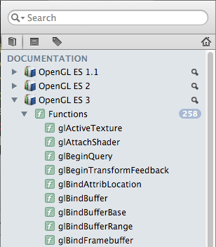

OpenGLES Dash DocSet
==================

Dash Docset for OpenGL ES 1.1, ES 2 and ES 3

Installation
------------
* Get automatically updated feeds directly in Dash by clicking on [one of the feed links](https://chinmaygarde.github.com/OpenGLESDashDocset)
* Or, download this repository and double click the docsets in the source directory. Dash should open up
